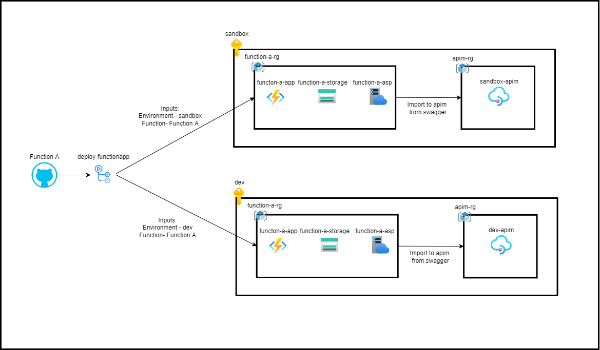

# Function App Lifecycle

## Code

### Function

Source code for the functions will be stored in the repo. Structure TBD.

### Infrastructure
Bicep templates will be stored in the repo. These templates will be used as the base for all function resources that need to be created. They include:
- Resource Group
- App Service Plan
- Storage Account

## Workflows

### Creating/Updating a function

This workflow will take the source code for a function, build it, deploy it, and update APIM in the specified environment. If necessary a new resource group, ASP, and storage account will be created to house the function. All Azure resource names will be consitently generated based off a combination of the function name and environment.

Inputs:
- Function source code location
- Environment

Variables:
- Subscription ID
- Resource group
- APIM
- Function app name
- Storage account name
- ASP name

Steps:
1. Get environment input
2. Get source code location
3. Get Azure resource names (generated from function source code and environment. ex. 'ticketing-app-sandbox')
4. Check if resource group for function already exists
    - True: Continue
    - False: Create resource group and necessary resources from base bicep templates
5. Build function
6. Deploy function
7. Import function to APIM using swagger doc as the source

Base Bicep for ASP
- name ($resourcename-ASP-$env)
- sku: standard
- location: centralus

Base Bicep for storage account
- name
- tier
- location

deploy:
- rg
- grab base bicep for storage account
    - input variables
    - deploy to rg in specified env
- grab base bicep for ASP
    - input variables
    - deploy to rg in specified env

apim:
- source is the bicep template

steps:
- update template
- grab env
- deploy to specified env

Microphone stoped working, one sec